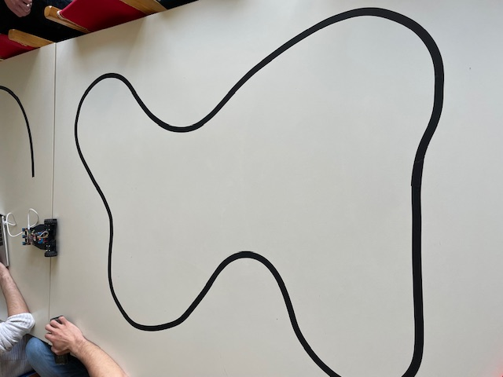
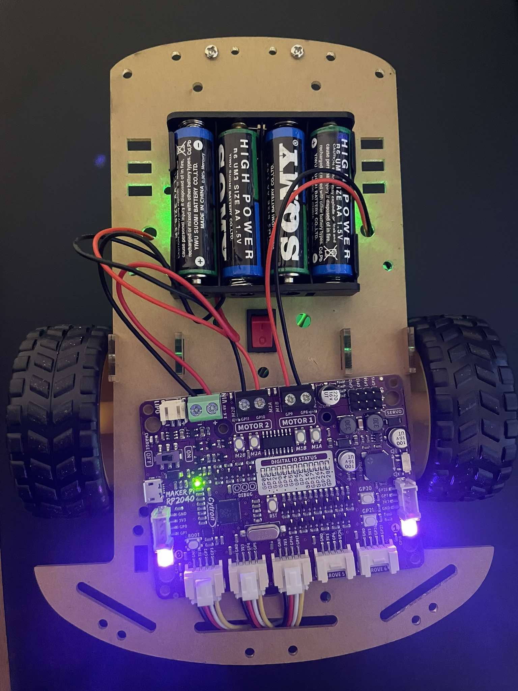
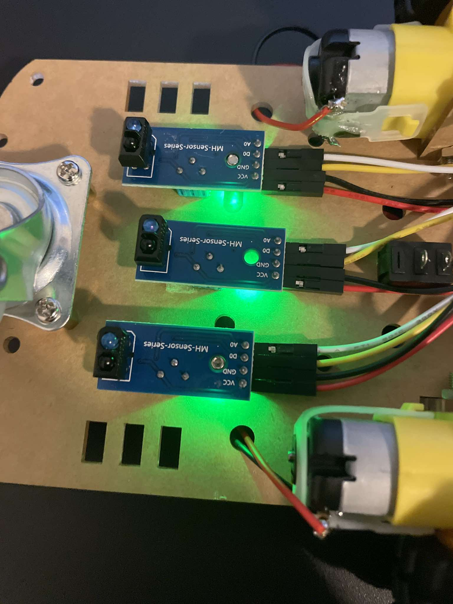

# Line Follower Car (MicroPython / RP2040)

A compact 2WD line-following robot that tracks a black tape line on a light surface using IR reflectance sensors. The controller runs **MicroPython** on an **RP2040** board with an onboard motor driver. The project includes two operating modes:
- **Line Follow** (button on **GP20**) — follows the line and **stops** on a full-black “stop line”
- **3-Lap Race** (button on **GP21**) — counts laps when crossing a wide start/finish line and stops after 3 laps (with cooldown to avoid double counts)

## Repository Contents

- `Robotaki_Car.py` — MicroPython control program (motors, sensors, modes)
- `Lap_BlackLine.jpg` — sample taped track layout
- `Car.jpg` — robot chassis/top view
- `Board_MicroPython.jpg` — RP2040 controller board close-up
- `Sensors.jpg` — IR sensor modules used for line detection

## Photos

### Track (black tape line)

### Robot chassis (top view)

### RP2040 controller board

### IR sensors

## Hardware

- RP2040 controller board with motor driver outputs (Motor 1 / Motor 2)
- 2x DC gear motors (left/right)
- IR reflectance sensor modules (digital output)
- Battery pack + power switch
- 2 push-buttons (mode selection)

## Pin Mapping (as used in `Robotaki_Car.py`)

### Motors (PWM, 20 kHz)
| Function | Pin |
|---|---|
| Left motor forward | GP11 |
| Left motor backward | GP10 |
| Right motor forward | GP8 |
| Right motor backward | GP9 |

### IR Sensors (digital inputs with pull-ups)
Sensors are grouped as **Left**, **Middle**, **Right** using two inputs per group.

| Group | Pins |
|---|---|
| Left | GP2, GP3 |
| Middle | GP4, GP5 |
| Right | GP16, GP17 |

### Buttons (pull-ups)
| Mode | Pin |
|---|---|
| Line Follow | GP20 |
| 3-Lap Race | GP21 |

## How It Works

1. **Reads sensors repeatedly** per loop and uses a majority decision to reduce noise.
2. **Steering logic**:
   - Middle detects line → go straight
   - Left detects line → turn left
   - Right detects line → turn right
   - No sensor detects line → “search” in the last known direction
3. **Stop / Lap detection**:
   - If Left + Middle + Right detect black simultaneously:
     - **Line Follow mode**: stop (treated as stop line)
     - **3-Lap Race mode**: count lap with a cooldown, stop after 3 laps

## Setup (MicroPython)

1. Flash MicroPython firmware to your RP2040 board (if not already installed).
2. Copy `Robotaki_Car.py` to the board (via Thonny or `mpremote`).
3. Ensure motors and sensors are connected to the correct pins (see Pin Mapping).
4. Power on the robot and place it on the track.

## Run

- Press **GP20** to start **Line Follow**
- Press **GP21** to start **3-Lap Race**

## Tuning

Inside `Robotaki_Car.py`, you can tune behavior depending on your motors, battery level, and tape contrast:
- `BASE_SPEED`, `TURN_SPEED`, `SEARCH_SPEED`
- `LEFT_ADJUST`, `RIGHT_ADJUST` (motor balancing)
- `MIN_DUTY` (minimum PWM threshold)

## Troubleshooting

- **Robot drives off the line**: reduce base speed; increase turn speed; verify sensor height and alignment.
- **Sensors always read “black”**: check wiring (VCC/GND), confirm pull-ups, and ensure the sensor output is digital.
- **Motors reversed**: swap motor polarity or swap forward/backward pins for that motor in the code.
- **Lap double-counting**: increase the line-detection cooldown value in the code.
